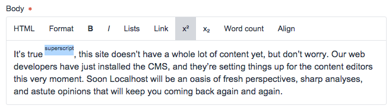
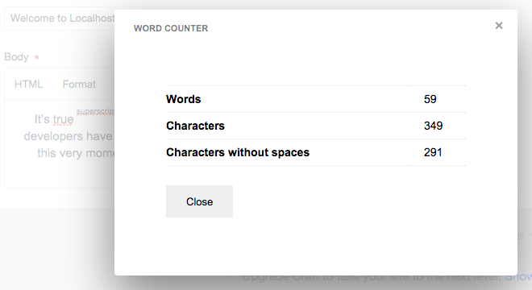
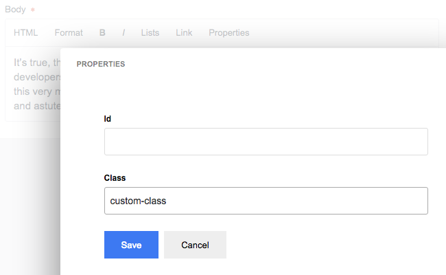
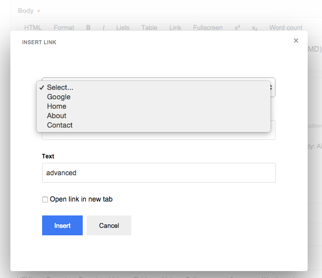

Redactor Extras for Craft
=========================

Useful Redactor plugins for Craft's richtext field
--------------------------------------------------

### Version History

[View the changelog for details](https://github.com/elliotlewis/Redactor-Extras/blob/master/changelog.json)

 * 1.3 : 17 March 2016
 * 1.2 : 8 March 2016
 * 1.1 : 16 February 2016
 * 1.0 : 10 February 2016

### Requirements

 + Craft 2.5+
 + Redactor 2

This has only been tested with the latest Craft, may or may not work in older versions. Definitely requires Redactor 2.

### Installation

Copy the redactorexatras folder into `craft/plugins`, then go to `Settings > Plugins` in the Craft Control Panel and click 'Install'.

### Configuration

Once installed, in Craft go to `Settings > Plugins` and click the small cog or go to `Settings > Redactor Extras`.

To use a plugin edit an existing config or create a new config json file as per Craft's [documentation](https://craftcms.com/docs/rich-text-fields#redactor-configs).

Turn on required plugins then an example config could be:

    {
        "plugins": ["scriptbuttons", "counter", "alignment"]
    }
    
### Description

Available plugins are:

 + Superscript and Subscript
 + Word count
 + Alignment
 + Properties
 + Predefined Links
 + Character Limiter
 + Custom plugin

#### Superscript and Subscript

Adds superscript and subscript buttons to the toolbar. In source, the text is surrounded with `` and ``.

	{
		"plugins": ["scriptbuttons"]
	}

#### Word / Character count

Adds a 'Word count' button to the toolbar. Overlay modal appears with word and character count.

	{
		"plugins": ["counter"]
	}

#### Alignment

Adds an 'Alignment' button to the toolbar. Aligns text block by adding a class, `text-center` or `text-right`.

	{
		"plugins": ["alignment"]
	}

#### Properties

Assign an id or class to any block level tag. From the cursor position outwrds, finds the first block level item, eg. p, ul. and adds `id="xx" or class="xx"`. Use the HTML source plugin to view code to see this in action.

	{
		"plugins": ["properties"]
	}

#### Predefined Links

Add a list of predefined links to the link menu. These can be external or internal. Probably best to let Craft handle internal link as it spports linking to Entries and Assets.

	{
        plugins:        ["definedlinks"],
        definedLinks:   [
            { "name": "Select...", "url": "" },
            { "name": "Google", "url": "http://google.com" },
            { "name": "Home", "url": "/" },
            { "name": "About", "url": "/about/" },
            { "name": "Contact", "url": "/contact/" }
        ]
    }

#### Character Lmiter

Limits the number of character in the rich text field to the value definied in <redactor-config>.json.

    {
        "plugins": ["limiter"],
        "limiter": 20
    }

### Your own custom plugin

There's also the option to create your own Redactor plugin and link to the JS and CSS files. Just fill-in the paths in settings under, 'Custom plugin'. The plugin code needs to follow the Craft way of wrapping/loading the JS. Check the included Redactor plugins as an example.